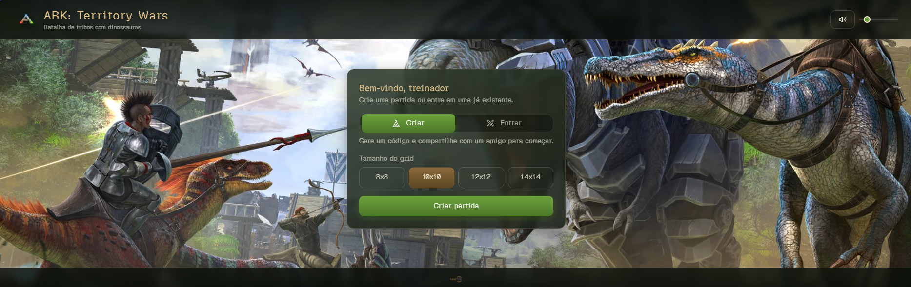
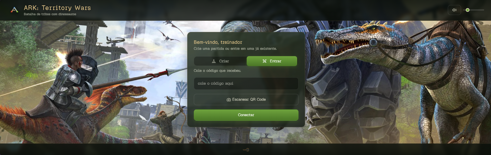
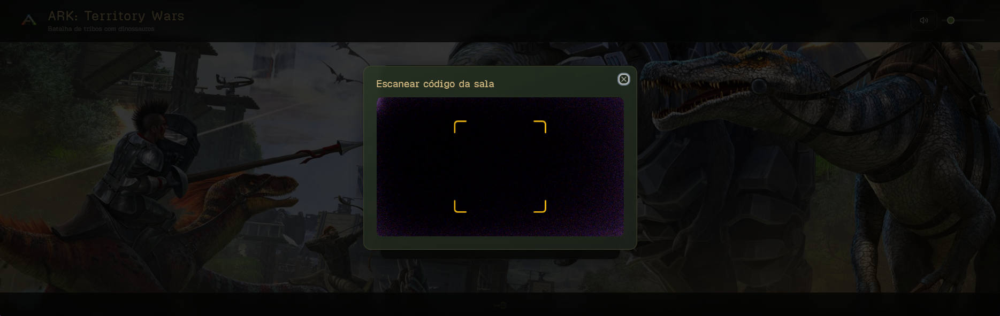
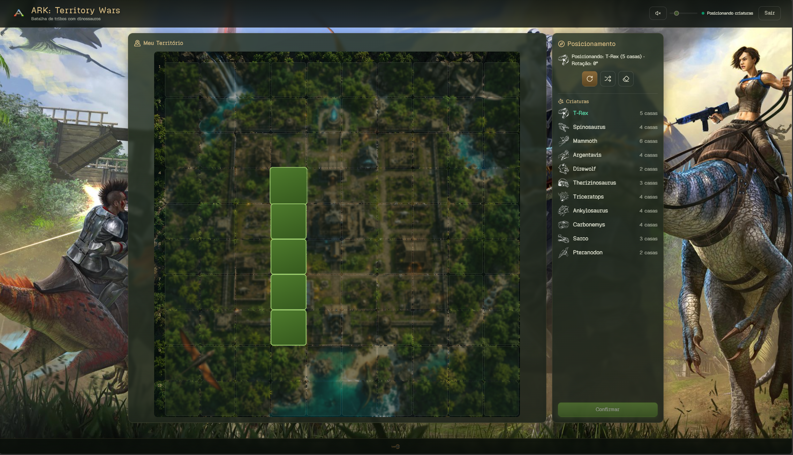
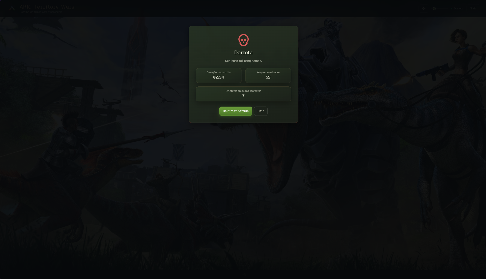

Batalha de tribos com dinossauros — um jogo de tabuleiro estilo "batalha naval" com tema de ARK: Survival Evolved. Posicione suas criaturas no grid, conecte-se com um amigo via P2P e ataque o território inimigo até destruir todas as criaturas dele.

> Projeto de fã, sem fins lucrativos e sem nenhum vínculo com a Studio Wildcard/ARK: Survival Evolved. Feito por inspiração de quem ama o jogo — os assets de imagem usados são apenas para fins de fã e ambientação.



## Funcionalidades

- **Multiplayer peer-to-peer**: conexão direta entre os dois jogadores via [PeerJS](https://peerjs.com/), sem necessidade de servidor de jogo.
- **Grid configurável**: escolha o tamanho do tabuleiro (8x8, 10x10, 12x12 ou 14x14) ao criar a partida.
- **Criaturas com formatos variados**: T-Rex, Spinosaurus, Mammoth, Argentavis, Direwolf, Therizinosaurus, Triceratops, Ankylosaurus, Carbonemys, Sarco e Pteranodon, cada uma ocupando um formato diferente no grid, com rotação e posicionamento automático.
- **Entrada na partida por código, QR Code ou link**: compartilhe o código da sala por texto, deixe o adversário escanear o QR Code pela câmera, ou envie um link direto que já preenche o código automaticamente.
- **Compartilhamento via WhatsApp**: botão que envia o código da sala direto pelo WhatsApp.
- **Turnos de ataque**: cada jogador ataca uma casa por vez, com feedback de acerto, erro e criatura abatida.
- **Áudio**: música de fundo por fase do jogo e efeitos sonoros (ataque, spawn, vitória, derrota), com controle de volume.
- **Tela de resultado**: duração da partida e número de ataques realizados ao final.

## Como jogar

### Criar uma partida

1. Escolha **Criar**, selecione o tamanho do grid e confirme.
2. Compartilhe o código gerado com o adversário (copiar código, QR Code ou WhatsApp).
3. Aguarde a conexão do adversário na sala.



### Entrar em uma partida

1. Escolha **Entrar**.
2. Cole o código recebido, escaneie o QR Code do host pela câmera, ou abra o link compartilhado (o código é preenchido automaticamente).
3. Confirme para conectar.



### Posicionar as criaturas

Posicione cada criatura no seu território, com opção de rotacionar, posicionar aleatoriamente ou limpar o tabuleiro. Confirme quando terminar.



### Batalhar

Os jogadores se revezam atacando o território um do outro até que todas as criaturas de um dos lados sejam abatidas.




## Rodando o projeto localmente

Pré-requisitos: Node.js e npm.

```bash
npm install
npm run dev
```

O servidor de desenvolvimento sobe em `http://localhost:5173`. Para testar o modo multiplayer localmente, abra duas abas/dispositivos e conecte um na sala do outro.

### Outros scripts

```bash
npm run build      # build de produção (saída em dist/)
npm run preview    # preview do build de produção
npm run lint       # lint com ESLint
npm run format     # formata o código com Prettier
```

## Stack técnica

- **React 19** + **Vite** + **TanStack Router** (SPA client-side, sem SSR)
- **Tailwind CSS 4** para estilização
- **PeerJS** para conexão peer-to-peer entre os jogadores
- **qrcode.react** para gerar o QR Code da sala
- **qr-scanner** para ler o QR Code pela câmera
- **Radix UI** + componentes estilo shadcn para a interface
- Deploy como SPA estática (ex.: Vercel)
